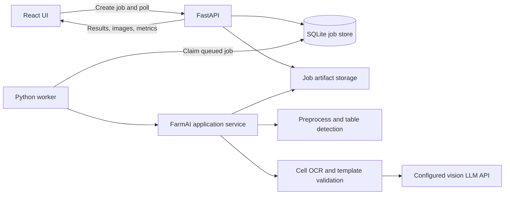

# FarmAI User Interface Implementation Plan

This document is the implementation brief for agents building the farm-facing
FarmAI user interface. Read `SUMMARY.md` and this file before changing code.
The existing `streamlit_app.py` remains a developer/debugging tool. The new
interface is a separate, task-focused application for farm workers.

## Implementation Status

The first vertical implementation is now present on the `interface` branch:

- shared document processing service with coordinate-aligned deskewed previews,
  overlays, template column identities, and cell-level progress
- persistent FastAPI job API backed by SQLite
- separate single-concurrency Python worker
- React upload, settings, progress, and two-pane result review screens
- editable table cells and reviewed CSV/JSON downloads
- template validation states and optional ground-truth CSV scoring
- cell selection linked to the detected overlay
- recent SQLite-backed jobs on the main screen with direct links
- confirmed deletion of queued/completed/failed jobs and their artifacts;
  actively running jobs are protected

The next priority is a pilot run with real `llm-vision` records, followed by
bounded LLM retries, richer worker recovery, and the multi-file batch workflow.

## 1. Product Goal

Build a simple review application that lets a user:

1. Upload one farm record image or PDF.
2. Start processing with sensible defaults.
3. Leave the page while the slow OCR job continues.
4. Return to see the job status and result.
5. Compare the detected grid overlay and extracted table side by side.
6. See which cells need attention and why.
7. Correct values and download the reviewed CSV.
8. Optionally upload a ground-truth CSV and view accuracy metrics.

The first release accepts one input file per job. The architecture must use a
persistent job model from the beginning so multi-file batches can be added
without replacing the UI or API.

## 2. Recommended Framework

Use:

- **Frontend:** React, TypeScript, and Vite
- **UI components:** Material UI
- **Icons:** Lucide React
- **Data grid:** AG Grid Community
- **Server state:** TanStack Query
- **Backend API:** FastAPI and Pydantic
- **Pilot job storage:** SQLite plus job artifact directories
- **Pilot worker:** a separate Python worker process that claims queued jobs
- **Testing:** Pytest/unittest for Python, Vitest and Testing Library for React,
  and Playwright for the main user flow

### Why this is the best fit

React provides precise control over the two-pane review screen, editable cells,
conditional colors, tooltips, progress views, and future batch dashboards. AG
Grid already handles editable tables, fixed headers, keyboard navigation,
cell-class rules, and tooltips well.

FastAPI keeps the FarmAI pipeline in Python and exposes typed results to the
frontend. The frontend must call Python service functions through the API; it
must not launch or parse the `farm-ai` CLI.

A Next.js or other Node-only backend would still need a Python service and
would add an unnecessary server layer. Streamlit remains useful for debugging,
but its session model and component customization are a poor fit for persistent
background jobs and detailed cell states.

SQLite and a dedicated polling worker are appropriate for a local pilot on
Windows. They provide job persistence without requiring Redis. Keep the queue
behind a small repository interface so it can later be replaced with Celery,
Dramatiq, or a managed queue.

## 3. Product Principles

- Show one obvious action at a time.
- Use plain language such as "Upload record", "Read record", and "Needs review".
- Hide technical settings until the user opens the gear menu.
- Preserve job state across refreshes and browser restarts.
- Never lose the raw OCR result when a user edits a value.
- Make questionable cells easy to find, explain, and correct.
- Do not show line masks, binarized images, model prompts, or other debug views
  in the worker-facing interface.
- Keep the existing Streamlit app for those debugging views.
- Design for a farm office desktop or tablet first, but keep upload and job
  status screens usable on mobile.

## 4. Default Settings

The first screen should expose only the record upload area and primary action.
The gear button opens an "Advanced settings" drawer or popover.

Use these defaults:

| Setting | Default | UI behavior |
| --- | --- | --- |
| Template | none | Display as "Detected table (no template)" |
| OCR engine | `llm-vision` | Display as "Best handwriting recognition" |
| Extra filtered columns | none | Template-level filters still apply |
| Ground-truth CSV | none | Optional upload |
| OCR crop padding | existing project default | Hide in first release |

The extra column filter is additive. The effective filtered set is:

```text
template filtered columns UNION user-selected extra filtered columns
```

An empty UI selection must never re-enable columns filtered by the template.
When a template is selected, show only non-template-filtered columns in the
extra filter selector.

Do not expose the LLM API URL, model name, timeout, or credentials in the
browser. Those remain backend environment settings.

## 5. Main User Flow

### 5.1 Upload

The initial page contains:

- FarmAI name in a restrained application header
- a gear icon in the top-right corner
- a large file drop area with an upload icon
- accepted types: PNG, JPG/JPEG, TIFF, BMP, and PDF
- the selected filename and a remove/replace action
- a primary "Read record" button

Avoid technical descriptions. A short status such as "No record selected" is
enough.

The optional ground-truth CSV is in Advanced settings. Also allow ground truth
to be attached after OCR finishes, because scoring existing results should not
rerun the expensive LLM OCR job.

### 5.2 Processing

Clicking "Read record" creates a job and immediately navigates to its status
screen. Do not keep the upload HTTP request open while OCR runs.

Show:

- filename
- current plain-language stage
- progress bar
- cells completed, when available
- elapsed time
- "You can close this page. Processing will continue."
- cancel action only if cancellation is safely implemented

Suggested visible stages:

```text
Waiting to start
Preparing image
Finding the table
Reading cells (42 of 160)
Checking results
Preparing review
Complete
```

Do not show a fake time remaining estimate until enough real timing data has
been collected. An elapsed timer and cell count are more trustworthy.

### 5.3 Review

On completion, display a stable two-pane workspace:

- **Left:** deskewed source image with the final detected grid overlay
- **Right:** editable OCR table

The panes should be independently scrollable. The image pane needs zoom in,
zoom out, fit-to-width, and reset controls using icon buttons with tooltips.

The table toolbar should contain:

- result summary
- "Needs review" count
- ground-truth accuracy, if available
- show-all / needs-review-only toggle
- undo/reset edits
- download CSV

Use a page selector when a PDF has multiple pages. Each page has its own overlay
and table, while the job summary covers the whole document.

### 5.4 Cell Review

Each table cell must have one of these states:

| State | Meaning | Suggested presentation |
| --- | --- | --- |
| `ok` | No known problem | Normal white cell |
| `validation_warning` | Template rule rejected or questioned the value | Amber background and warning icon |
| `ground_truth_mismatch` | OCR differs from ground truth | Red/pink background |
| `mismatch_and_warning` | Both conditions apply | Red/pink background with warning icon |
| `correct` | Matches ground truth | Optional subtle green check, not a full green table |
| `unscored` | No ground truth is available | Normal cell |
| `edited` | User changed the OCR value | Blue corner marker or small "Edited" indicator |

Hovering or focusing a flagged cell must show:

- reason
- OCR value
- raw rejected value, if available
- expected ground-truth value, if available
- template rule, format, or range that failed

Do not rely on color alone. Include icons, accessible labels, and tooltip text.

Clicking a table cell should highlight the corresponding bounding box in the
overlay. Clicking a box in the overlay should select and scroll to the table
cell. This interaction is strongly recommended because it makes correction
faster and provides useful feedback about crop or grid errors.

### 5.5 Completion

Users can edit cells directly. Store these separately:

- `ocr_text`: immutable engine output
- `reviewed_text`: latest user-approved value
- `was_edited`: whether they differ

CSV download should use reviewed values. JSON download may include both values,
cell coordinates, validation metadata, and scoring metadata.

Provide a clear "Review complete" action later if supervisor feedback requires
an explicit workflow state. For the first release, saving edits automatically
and downloading the corrected CSV is enough.

## 6. Architecture



### Important boundary

Extract reusable processing orchestration from `streamlit_app.py` and
`main.py` into a Python application service. Both UIs and the CLI may call that
service. Do not import Streamlit from the backend and do not duplicate the OCR
pipeline in FastAPI route handlers.

Suggested shared module:

```text
src/application/
  __init__.py
  processing.py
  ground_truth.py
  result_models.py
```

The application service should accept typed settings and return a typed result,
not write arbitrary debug output or print CSV to stdout.

## 7. Proposed Directory Layout

```text
user_interface/
  IMPLEMENTATION_PLAN.md
  frontend/
    package.json
    vite.config.ts
    src/
      api/
        client.ts
        jobs.ts
      components/
        AppHeader.tsx
        FileDropzone.tsx
        JobProgress.tsx
        OverlayViewer.tsx
        OcrResultGrid.tsx
        SettingsDrawer.tsx
        StatusSummary.tsx
      pages/
        UploadPage.tsx
        JobPage.tsx
      types/
        api.ts
      App.tsx
      main.tsx
  backend/
    __init__.py
    app.py
    config.py
    database.py
    repository.py
    schemas.py
    worker.py
    routes/
      jobs.py
      settings.py
    services/
      job_runner.py
      artifact_store.py
  tests/
    backend/
    e2e/
  runtime/
    .gitkeep
```

Add `user_interface/runtime/` to `.gitignore`. Runtime data should look like:

```text
user_interface/runtime/
  farmai_ui.sqlite3
  jobs/
    <job_id>/
      input/
      ground_truth/
      pages/
        1/
          deskewed_source.png
          overlay.png
          result.json
          result.csv
```

Never derive storage paths directly from an uploaded filename. Use generated
job IDs and retain the sanitized original filename as metadata.

## 8. Job Model

Use UUIDs for job IDs. Persist at least:

```text
id
status
stage
progress_current
progress_total
original_filename
template_id
ocr_engine
extra_filtered_columns_json
created_at
started_at
completed_at
updated_at
error_code
user_safe_error
artifact_directory
```

Recommended statuses:

```text
queued
running
completed
completed_with_warnings
failed
cancelled
```

Only the worker may transition a job from `queued` to `running`. Use a database
transaction when claiming work so two workers cannot run the same job.

Run one LLM OCR job at a time by default during the pilot. Make worker
concurrency configurable later. This protects the current API from overload and
makes observed processing times easier to interpret.

The worker should recover jobs left in `running` after an unexpected shutdown
by marking them failed or re-queueing them according to an explicit retry
policy.

## 9. FarmAI Service Changes

### 9.1 Coordinate-consistent deskewed preview

The current preprocessing pipeline deskews the binarized image used for table
detection, while some existing overlays and OCR calls use the original page
image. That can put the grid and source image in different coordinate systems.

Refactor skew handling so the same estimated angle and affine transform are
applied to:

- the binary/detection image with nearest-neighbor interpolation
- the original color or grayscale source with linear interpolation

Use the deskewed source image for:

- OCR cell crops
- the worker-facing preview
- the grid overlay

The final overlay must be generated in exactly the same coordinate system as
the OCR cell bounding boxes. Add a regression test with a visibly skewed
synthetic table.

### 9.2 Progress reporting

Add an optional progress callback to the application service and cell OCR loop.
Report after each cell without coupling `src/ocr` to FastAPI or SQLite.

Example protocol:

```python
ProgressCallback = Callable[[ProcessingProgress], None]
```

The callback payload should include:

```text
stage
completed
total
page_number
page_count
message
```

Throttle database updates if necessary, but expose cell-level progress for
`llm-vision`.

### 9.3 Rich result mapping

The current `OcrCell` contains row, compacted column index, bounding box, text,
confidence, raw text, and validation error. The UI response also needs stable
column identity.

Create a presentation/result DTO that adds:

```text
page_number
row
column_index
source_column_index
column_key
column_name
bbox
ocr_text
reviewed_text
confidence
raw_text
validation_error
ground_truth_text
ground_truth_match
```

Do not infer column identity in React from a header string. Map compacted OCR
columns to the ordered, non-filtered template columns in Python. Header row
cells are metadata and should not count toward handwriting accuracy.

### 9.4 LLM resilience

The UI job must not fail an entire document because one cell request times out.
Add bounded per-cell retries with backoff for timeout and transient server
errors. After retries are exhausted, record a validation/error reason on that
cell, continue the job, and finish as `completed_with_warnings`.

Do not retry permanent configuration or authorization errors for every cell.
Fail the job early with a concise user-safe error and retain technical details
in backend logs.

## 10. Ground-Truth CSV Contract

For the first release, accept a conventional table CSV:

```csv
Date,Current Temperature,HI,LO,Comments
01-May,67.8,95,,All good
02-May,83,73.3,68,All good
```

Rules:

- Headers must map uniquely to the selected template's visible columns. Template has columns with key like `divider*`, these will not be in the csv, so ignore them.
- Header matching may ignore surrounding whitespace and case.
- The CSV header row is not scored.
- Data rows align by row position for the first release.
- Empty CSV values are valid ground-truth blank cells and are scored.
- Extra unknown columns are an upload error.
- Missing required visible columns are an upload error.
- A row-count mismatch is an upload error with a useful message.
- Preserve original ground-truth strings for display.

Use UTF-8 with optional BOM support. Parse CSV with Python's `csv` module or
pandas, never by splitting lines or commas.

### Comparison rules

Report two metrics:

1. **Exact cell accuracy:** compare after trimming leading/trailing whitespace
   and normalizing line endings. Preserve case and punctuation.
2. **Normalized cell accuracy:** optional secondary metric using
   template-aware normalization, such as case-folding common text values and
   comparing parsed numeric values.

Exact cell accuracy is the primary number shown in the UI. Do not silently use
fuzzy matching for the primary metric.

Calculate:

```text
correct cells / scored cells
incorrect cells
accuracy by column
fully correct rows / scored rows
template validation warning count
```

Keep validation and ground-truth correctness separate. A value may satisfy a
temperature regex and still be the wrong temperature.

Ground truth should be attachable through:

- the Advanced settings menu before starting a job
- the completed job screen without rerunning OCR

Re-scoring a stored result must be fast and must not contact the LLM.

## 11. API Contract

Prefix routes with `/api`.

### Settings

```text
GET /api/settings
```

Return available templates and OCR engines with friendly labels, plus defaults.
Do not return secrets or the LLM URL.

### Create job

```text
POST /api/jobs
Content-Type: multipart/form-data
```

Fields:

```text
record: required file
ground_truth: optional CSV file
settings: JSON string containing template_id, ocr_engine, extra_filtered_columns
```

Return HTTP 202:

```json
{
  "job_id": "uuid",
  "status": "queued",
  "status_url": "/api/jobs/uuid"
}
```

### Job status

```text
GET /api/jobs/{job_id}
```

Return persisted status, stage, progress, timestamps, filename, and a
user-readable error when applicable.

### Job result

```text
GET /api/jobs/{job_id}/result
```

Return document summary, page summaries, columns, cells, validation counts,
ground-truth metrics, and artifact URLs.

### Artifacts

```text
GET /api/jobs/{job_id}/pages/{page_number}/overlay
GET /api/jobs/{job_id}/pages/{page_number}/source
GET /api/jobs/{job_id}/download.csv
GET /api/jobs/{job_id}/download.json
```

### Edits and ground truth

```text
PATCH /api/jobs/{job_id}/cells
POST  /api/jobs/{job_id}/ground-truth
DELETE /api/jobs/{job_id}/ground-truth
DELETE /api/jobs/{job_id}
```

The cell edit payload uses page, row, and stable column key. Use optimistic
concurrency or an `updated_at` value to avoid silently overwriting newer edits.
Job deletion removes the validated `runtime/jobs/<job_id>` artifact directory
and then its SQLite row. It returns HTTP 409 while a job is actively running.

### Future batch endpoint

```text
POST /api/batches
GET  /api/batches/{batch_id}
```

A batch owns multiple existing job records. Shared settings are copied to each
job. The review screen and result schema remain unchanged.

## 12. Frontend State and Routing

Use routes:

```text
/                    upload screen
/jobs/:jobId         status or review screen
```

The job page should fetch current state from the backend. Poll every two to five
seconds while queued/running and stop polling at a terminal state. A page
refresh must restore progress or completed results by URL.

The upload screen now includes the recent-jobs table. A dedicated `/jobs`
dashboard remains optional for the later batch phase.

Do not store images, OCR results, or ground truth only in React state. The
backend is the source of truth.

## 13. Error Handling

Map technical failures to useful messages:

| Failure | User-facing message |
| --- | --- |
| Unsupported or corrupt upload | "This file could not be opened. Try a PDF, JPG, or PNG." |
| No table found | "FarmAI could not find the table in this record." |
| LLM not configured | "Handwriting recognition is not configured on this computer." |
| LLM authorization failure | "The handwriting service could not be accessed. Contact the project administrator." |
| Some cell timeouts | Complete with warnings and flag affected cells |
| Ground-truth shape mismatch | Explain expected and received rows/columns |

Keep stack traces and request details in backend logs only.

## 14. Accessibility and Farm-User Usability

- Use a minimum 44 by 44 pixel target for primary controls.
- Use high-contrast text and status colors.
- Pair every icon-only control with a tooltip and accessible name.
- Make the full review flow keyboard accessible.
- Keep labels short and avoid terms such as "OCR backend", "binarization", or
  "template grid reconstruction" outside Advanced settings.
- Confirm destructive actions such as deleting a job.
- Keep the selected settings visible in a small read-only summary on the job
  screen, but do not dominate the interface.
- Display times in the user's local timezone.
- Preserve unsaved cell edits during temporary network failures.

## 15. Security and Data Handling

- Keep `.env` and LLM configuration on the backend.
- Validate file extensions, MIME types, and decoded content.
- Set configurable upload size and PDF page limits.
- Sanitize display filenames and never use them as storage paths.
- Restrict artifact access to known job IDs and resolved job directories.
- Configure CORS narrowly in deployment.
- Do not log full uploaded images or base64 LLM payloads by default.
- Document that cropped record cells are sent to the configured external LLM
  service when `llm-vision` is selected.
- Add a configurable retention policy and a way to delete completed pilot jobs.
- Run the pilot on a trusted local network unless authentication is added.

## 16. Implementation Phases

### Phase 0: Shared processing service

1. Extract UI-neutral orchestration from `streamlit_app.py`/`main.py`.
2. Produce coordinate-consistent deskewed source images and overlays.
3. Add stable result DTOs and template column identity.
4. Add progress callback support through page and cell processing.
5. Add unit tests without contacting the real LLM.

Acceptance criteria:

- CLI and Streamlit behavior remain compatible.
- A Python test can process a mocked document and receive table, cell metadata,
  overlay image, and progress events.
- Overlay boxes align with OCR crop coordinates after deskewing.

### Phase 1: Single-file background API

1. Add FastAPI configuration, schemas, SQLite repository, and artifact store.
2. Implement job creation, status, worker claim, processing, and result routes.
3. Persist failures and recover cleanly from worker restarts.
4. Add per-cell transient retry behavior.
5. Test the API with a fake OCR engine.

Acceptance criteria:

- `POST /api/jobs` returns in a few seconds with HTTP 202.
- Processing continues after the browser disconnects.
- Refreshing `/jobs/{id}` restores status.
- A single cell timeout does not discard the rest of the table.

### Phase 2: Worker-facing React interface

1. Build upload and Advanced settings screens.
2. Build persisted progress screen.
3. Build two-pane overlay/table review screen.
4. Add table editing, tooltips, status coloring, and CSV download.
5. Add cell-to-overlay selection linking.
6. Verify desktop, tablet, and narrow viewport layouts with Playwright.

Acceptance criteria:

- A nontechnical user can complete upload, processing, review, correction, and
  download without seeing developer/debug controls.
- Validation warnings are visible and explained without relying on color.
- The longest column labels and values do not overlap controls.

### Phase 3: Ground-truth scoring

1. Implement CSV validation and header mapping.
2. Implement exact and normalized metrics.
3. Add upload-before-run and attach-after-run flows.
4. Add mismatch colors, tooltips, summary metrics, and per-column breakdown.
5. Add tests for blanks, quoted commas, row mismatches, and header errors.

Acceptance criteria:

- Attaching ground truth never reruns OCR.
- Every scored cell can show OCR and expected values.
- Summary counts equal the visible cell states.

### Phase 4: Batch workflow

1. Allow multiple record files in one upload action.
2. Create a batch record that owns individual jobs.
3. Add a recent jobs/batches dashboard with queued, running, completed, and
   failed filters.
4. Add batch-level downloads, retry failed jobs, and resume review.
5. Measure LLM throughput before increasing worker concurrency.

Acceptance criteria:

- Users can leave and return to a batch by URL.
- One failed document does not fail the entire batch.
- Each completed document opens in the same review screen built in Phase 2.

## 17. Test Strategy

### Backend unit tests

- settings/default resolution
- template-level plus user-level filter union
- compacted column index to template key mapping
- job state transitions and exclusive worker claims
- progress event persistence
- ground-truth CSV parsing and exact scoring
- artifact path traversal protection
- LLM timeout classification and retry policy

### API integration tests

- create, poll, complete, and retrieve a job using a fake OCR engine
- refresh/restart persistence
- invalid upload responses
- attach and replace ground truth
- edit a cell and download reviewed CSV
- partial cell failures return `completed_with_warnings`

### Frontend tests

- default upload flow hides advanced settings
- settings show correct defaults
- progress polling stops on completion/failure
- each cell state receives the correct style and tooltip
- editing preserves original OCR metadata
- ground-truth metrics render only when available

### End-to-end tests

Use Playwright with a deterministic fake backend job:

1. Upload a sample image.
2. Open settings and verify defaults.
3. Start the job and observe progress.
4. Refresh the page during processing.
5. Review the completed overlay and table.
6. Attach ground truth and inspect an incorrect cell.
7. Correct the value and download CSV.

Do not call the real LLM in automated tests.

## 18. Development Commands

Run Python commands in the existing conda environment:

```powershell
conda activate farm-ai
```

When implementation begins, install backend dependencies in that environment:

```powershell
python -m pip install fastapi uvicorn python-multipart
```

Scaffold the frontend from the repository root:

```powershell
npm create vite@latest user_interface/frontend -- --template react-ts
cd user_interface/frontend
npm install
npm install @tanstack/react-query @mui/material @emotion/react @emotion/styled
npm install ag-grid-community ag-grid-react lucide-react react-router-dom
```

Expected development processes:

```powershell
conda activate farm-ai
python -m uvicorn user_interface.backend.app:app --reload --port 8000
```

```powershell
conda activate farm-ai
python -m user_interface.backend.worker
```

```powershell
cd user_interface/frontend
npm run dev
```

These commands are planning targets. Add the dependencies to project metadata
and add exact scripts once the corresponding code exists.

## 19. Deliberate Non-Goals for the First Release

- User accounts and role management
- Cloud deployment
- Automatic template detection
- Real-time collaborative editing
- Debug line/intersection/binary-image views
- Arbitrary ground-truth schemas
- High-concurrency LLM processing
- Mobile-first table editing

## 20. Agent Handoff Checklist

Before implementing a phase:

1. Read `SUMMARY.md`, this file, and the directly affected source modules.
2. Check `git status` and preserve unrelated user changes.
3. Run commands in conda environment `farm-ai`.
4. Keep the Streamlit debugger operational.
5. Mock the LLM in all automated tests.
6. Add tests in proportion to each API or shared pipeline change.
7. Do not expose `.env` values to the frontend.
8. Verify the overlay and OCR crops share one coordinate system.
9. Verify template filters cannot be overridden by an empty UI filter.
10. Update this plan when an architectural decision changes.

## 21. Recommended First Implementation Slice

Begin with Phase 0 and a thin vertical slice of Phase 1:

1. Create the shared processing result model.
2. Fix deskewed color/source coordinate alignment.
3. Add cell-level progress callbacks.
4. Create one queued job through FastAPI.
5. Process it in the worker with a fake OCR engine.
6. Return one overlay and one structured result.

Once that slice is covered by tests, build the upload/progress/review screens
against the stable API. This sequence addresses the slow LLM behavior early and
prevents frontend work from depending on temporary CLI output formats.
